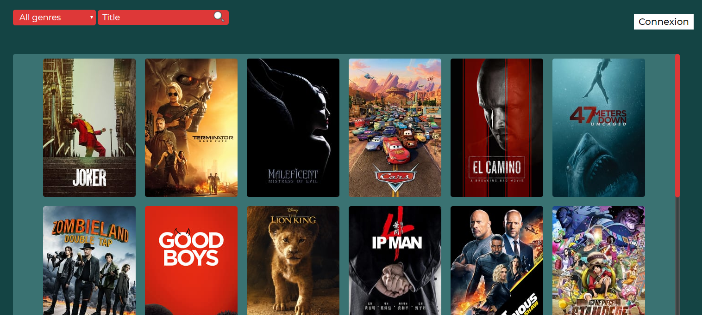
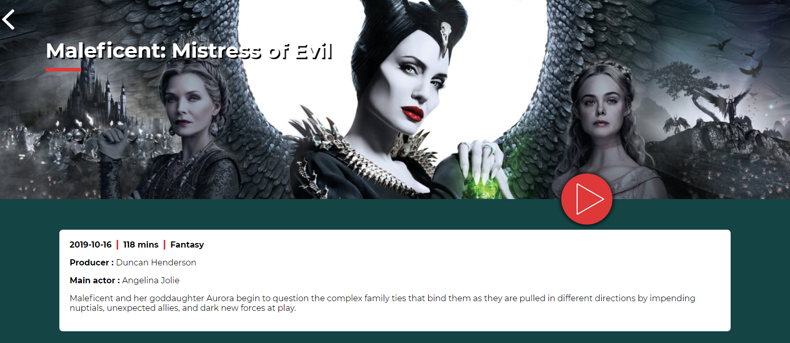

# Swift Peek

Swift Peek regroupe près de 10 000 films avec toutes les informations nécessaires pour faire le bon choix lors de votre prochaine soirée film.

# Fonctionnalités

Swift Peek présente une interface regroupant la bande annonce et la description détaillée pour chaque film. Une interface réservée aux membres permet également de commenter le film et de partager vos impressions ou vos attentes.

Servez-vous des filtres pour retrouver un film plus facilement !

## Technologies/Langages
* Html
* Css
* JavaScript
* PHP
* SQL
* themovieDB API
* Youtube API

# Dev Team
* **Adam Loukili**
* **Moise Nsengiyumva**
* **Freddy Matime**
* **Ayoub Ochan**
